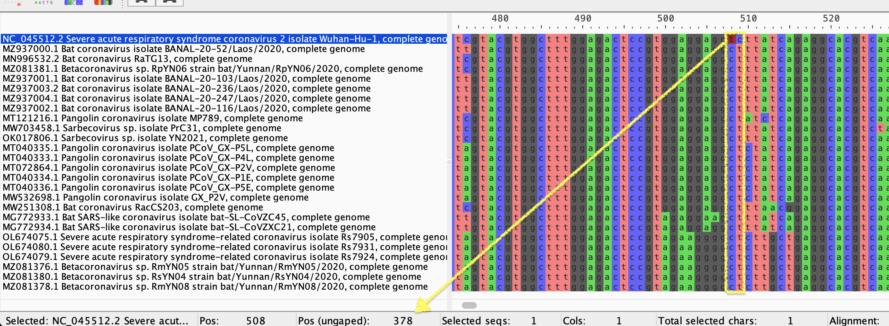

This alignment is necessary to generate the conserved positions in the family of viruses that are
closest to SARS-CoV-2. How does it work?
Each genome is loaded into a list. The script loops over each genome record and identifies the allele at each nucleotide position.
### `SRAFunctions/conserved.py`
In this part of the code, it loads the aligned fasta file and creates a set of entries where we can identify each entry record based on the corresponding 'id' i.e. "NC_045512.2"
```commandline
fasta = list(SeqIO.parse(FILE_NAME, format='fasta'))

seqs = {}
for entry in fasta:
    seqs[entry.id] = entry
```

### This is the main section of the algorithm for counting the allele in each nucleotide position per entry.
#### How it works
- Initialize variables for nucleotide counts, position in the sequence, and an empty dictionary for storing conserved positions.
- Iterate through each nucleotide position in the reference genome sequence.
- For each position, count the occurrences of each nucleotide (A, C, G, T) across all sequences in the fasta file.
- Calculate the percentage of each nucleotide at the current position. (not currently used)
- Check if any of the nucleotides meet the conservation threshold and are different from the reference nucleotide at the ungapped position.
- If conservation criteria are met, add the ungapped position and conserved allele index to the dictionary.
- Reset the counts and move to the next nucleotide position.
```commandline
def conserved() -> dict:
    position_legend = {'a': 0, 'c': 1, 'g': 2, 't': 3}
    count_a = 0
    count_c = 0
    count_g = 0
    count_t = 0
    nucleotide = 1
    conserved_dict = dict()
    while nucleotide <= len(seqs[REF_GENOME].seq):
        # loop through each nucleotide per genome
        for record in fasta:
            # return nucleotide value at this position
            nt = record.seq[nucleotide - 1]
            if nt != '-':
                if nt == 'a':
                    count_a += 1
                elif nt == 'c':
                    count_c += 1
                elif nt == 'g':
                    count_g += 1
                elif nt == 't':
                    count_t += 1
        # create a numpy array with sum total per nucleotide
        data = np.array([count_a, count_c, count_g, count_t])
        # convert to float (proportion rather than absolute)
        percentages = data / data.sum(axis=0)
        # combine both into 1 data structure
        out = list(zip(data, percentages))

        for i, item in enumerate(out):
            # reference nucleotide value
            reference = seqs[REF_GENOME].seq[nucleotide - 1]
            # must be higher or equal to threshold and reference
            # must not be a gapped position
            if item[0] >= LIMIT and reference != '-':
                check_ref_nucleotide = position_legend[reference]
                # if reference nucleotide does not match conserved position
                # append that position and conserved allele to a list
                if check_ref_nucleotide != i:
                    conserved_dict[int(ungapped_pos(seqs[REF_GENOME].seq, nucleotide))] = i
        # clear counter
        count_a = count_c = count_g = count_t = 0
        # go to next nucleotide position
        nucleotide += 1
    return conserved_dict
```
The given function ungapped_pos takes a sequence (seq) and a position (pos) as input, and returns the position without considering gaps (indicated by '-') in the sequence. The function works by iterating through the sequence and counting the number of gaps and non-gaps until the given position is reached. Then it returns the position without gaps by subtracting the count of gaps from the original position.
```commandline
def ungapped_pos(seq, pos):
    """This function returns the un-gapped position"""
    # Counter for gaps (-) and non-gaps (a c g t)
    non_gap = 0
    gaps = 0
    # Loop over each nucleotide in the sequence
    for nt in seq:
        # If nucleotide is not a gap add 1 to non_gap
        if nt != '-':
            non_gap += 1
        # Else add 1 to gaps
        else:
            gaps += 1
        # Return position without gaps
        if pos == (gaps + non_gap):
            return pos - gaps
```

Both of these functions work in tandem in order to generate this output:
`{378: 1, 379: 3, 487: 3, 511: 1, 544: 3, 1104: 1, 1288: 3, 1391: 1, 2110: 3, 2731: 0, 2881: 3, 3602: 0, 4442: 0, 5128: 2, 5305: 0, 5348: 3, 5368: 2, 5374: 0, 5648: 1, 5665: 0, 5730: 3, 5839: 2, 6196: 3, 6262: 1, 6446: 0, 6509: 2, 7267: 3, 7479: 1, 8266: 3, 8623: 1, 8782: 3, 9220: 0, 9693: 3, 10138: 3, 10156: 3, 10228: 3, 10456: 3, 11077: 1, 11081: 2, 11200: 3, 11227: 1, 12439: 0, 12781: 3, 14032: 2, 14220: 3, 14262: 3, 15258: 1, 15273: 3, 15540: 3, 16563: 0, 16692: 1, 16768: 0, 18408: 1, 18486: 3, 18813: 1, 20229: 1, 20393: 1, 20898: 3, 20940: 0, 21234: 3, 21306: 3, 21501: 3, 21662: 0, 21711: 3, 22147: 0, 22264: 3, 22267: 3, 22676: 0, 22858: 3, 23117: 0, 23191: 3, 23260: 3, 24049: 3, 24130: 3, 24490: 2, 24697: 0, 24995: 1, 24997: 3, 25033: 0, 25413: 3, 25420: 1, 25475: 1, 25645: 1, 25648: 1, 25827: 1, 25854: 3, 26168: 1, 26606: 3, 26714: 1, 27328: 1, 27429: 3, 27687: 0, 28144: 1, 28382: 1, 29072: 1, 29073: 0, 29095: 3, 29212: 0, 29341: 1, 29518: 3}`

This is a dictionary of nucleotide positions and what the conserved nucleotide is at each position.
For example, notice in the image the highlighted Pos(ungaped) C378T is conserved across 
the whole family of viruses but it's a transition in reference. 379 is also in the dictionary as 379:3 (0: A, 1: C, 2: G, 3: T) as well as in the image T379C. 



# Ancestral Minor Variant Analysis

For each SRR that I analyse, I generate the nucleotide makeup of each position in a file that looks like this:

### Legend
#### chr pos A C G T N a c g t n IN DEL indel

I then analyse each ancestral position and add them up together here:
```commandline
for idx, accession in enumerate(my_acc_file_lines):
            # creates an Accession object which creates Path objects
            acc = Accession(accession)
            print(f"{str(idx)}/{str(len(my_acc_file_lines))} {acc.acc}")
            if acc.my_sam_mpileup_file.exists() is False and acc.my_bam_file_sorted.exists():
                functions.gen_pileup(acc)
                functions.read_pileup_write_allele(
                    acc.acc, acc.my_sam_mpileup_file, acc.my_alleles_text_file)
                my_allele_lines = functions.open_file_return_lines(acc.my_alleles_text_file)
                split_line = [line.split("\t") for line in my_allele_lines]
                row_dict = {int(item[1]): {'a': int(item[2]) + int(item[8]), 'c': int(item[3]) + int(item[9]), 'g': int(item[4]) + int(item[10]), 't': int(item[5]) + int(item[11])}
                            for item in split_line}
                for key in alleles.keys():
                    try:
                        percentages = functions.calculate_noise_return_percentages(row_dict[key]['a'],
                                                                                   row_dict[key]['c'],
                                                                                   row_dict[key]['g'],
                                                                                   row_dict[key]['t'])
                        data[acc.acc].append(percentages[alleles[key]])
                    except KeyError as ex:
                        print(f"Key {ex} doesn't exist")
```
I'm reading each line from the NT file and calculating the proportion of the ancestral nucleotide and adding it all together per SRR
to give me an overall score, so how many full mutations there are as well as minor mutations.

Here is the function that does that calculation.
It removes noise from the count as Illumina does contain some noise in the signal.

```commandline
def calculate_noise_return_percentages(row_a: int, row_c: int, row_g: int, row_t: int):
    """Calculate the noise in each row and return percentages(float) without noise"""

    nt_array = np.array(
        [row_a, row_c, row_g, row_t])
    if nt_array.sum() > 30:
        a, b = np.partition(nt_array, 1)[0:2]
        noise = a + b / 2
        nt_array = nt_array - noise
        nt_array = nt_array.clip(min=0)
        perc_array = nt_array / nt_array.sum(axis=0)
        return perc_array
    else:
        nt_array = np.array([0, 0, 0, 0])
        return nt_array
```

I then rank each SRR based on the 'oldest' score the amount of ancestral mutations that it has 
and it spits out the result in this format.
